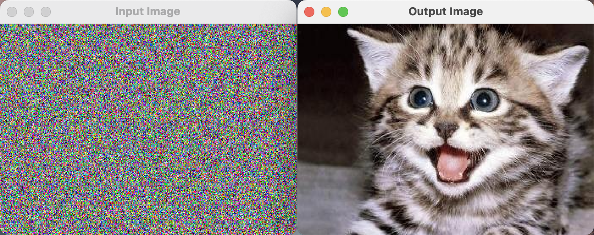

# PS1: Linear Feedback Shift Register (part B)

## Contact

Name: Zhuojian Chen (James)

Student ID: 02151380

Section: COMP 2040 P 1 203

Time to Complete: Jan 28, 2024

## Program Functionality

### Core functionality

This program successfully takes an input image file and an alphanumeric password to generate a seed for the LFSR. It performs bitwise operations to transform the given image's pixel values by applying the FibLFSR algorithm to each color component (red, green, and blue) of every pixel.

The processed image is then saved to the given output filepath. Finally, SFML is used to create two windows displaying the input image file and the processed image.

### Partial Functionality

The `PhotoMagic::transform()` function is the most significant part of this coursework. It takes an image and a `FibLFSR` instance to alter the image's pixels. Each pixel's color components (red, green, blue) undergo two steps: first, a pseudo-random 8-bit number is generated using FibLFSR, and then, this number is bitwise XORed with each color component.

```c++
pixel.r ^= fibLfsr->generate(8);
pixel.g ^= fibLfsr->generate(8);
pixel.b ^= fibLfsr->generate(8);
```

This process transforms the entire image, demonstrating the application of the Fibonacci Linear Feedback Shift Register algorithm in image manipulation.

### Extra Feature (for Extra Credit)

An additional functionality includes the ability to convert an alphanumeric password into a binary seed string. This enhances user convenience and expanding the range of possible seeds. A test case is also added to test the functionality of the associated function `PhotoMagic::convertPasswordToSeed()`.

## Extra Tests

Two extra tests are added to the `test.cpp` in this coursework.

### 1

This test case evaluates the functionality of the `PhotoMagic::convertPasswordToSeed()` function. It ensures that the return value of this function is the length of 16 and each character is either '0' or '1'.

### 2

This test case verifies the correctness of the `PhotoMagic::tranform()` function. An image should be completely the same as the original image after being transformed twice by the same seed. This is because, two `FibLFSR` objects created by the same initial seed always generate the same pseudo-number sequence. Moreover, an integer (or a bit stream) equals to itself after being XORed by the same number twice, that is said:

~~~
(N ^ R) ^ R == N
~~~

With these features, we can easily prove that an image is the same as itself after being transformed twice by the same seed.

## Display

### Encrypt Screenshot


### Decrypt Screenshot

