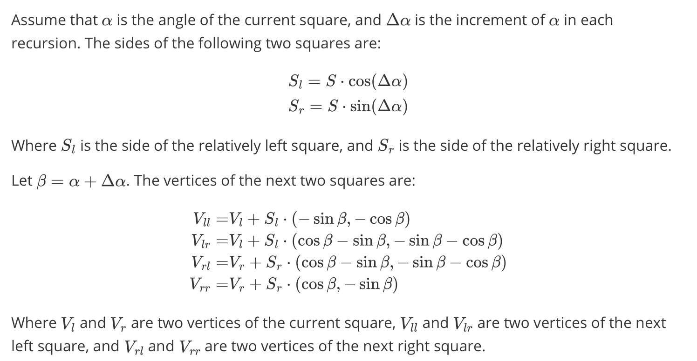

# PS2: Pythagorean Tree

## Contact

Name: Zhuojian Chen (James)

Student ID: 02151380

Section: COMP 2040 P 1 203

Time to Complete: Feb 9, 2024

## Description

This program allows user to input up to three arguments, which is `L` (the length of the base square), `N` (The depth of the recursion), and `A` ([Optional] The angle theta). It will draw a colorful Pythagorean tree according to the input arguments.

### Features

Describe what your major decisions were and why you did things that way.

In my program, I created a struct `Square`, which consists of the top-left corner coordinate, top-right corner coordinate, the side of the square, and the angle between the positive direction of the x-axis and the main side, where the main side is the line segment between the two corner coordinates aforementioned.

The function `pTree` does the following three things:

1. Draw the square onto the window using the `drawSquare` function.
2. Gets the next two squares using the `getNextSquares` function.
3. Recursively call `pTree` and pass the next two squares respectively.

The `drawSquare` function is intuitive and simple. However, the `getNextSquares` function contains some complicated math operation. I spent two hours on this problem and finally I got the math equations. I applied them to the code:

### Issues

In the instruction, we are required that our program should satisfy this: "A large value for L should not cause the image to spill over the boundary of your window and a small value should not cause most of the window to be empty space."

I tried to dynamically compute the window size and the position of the base square, but the window still not be able to fit into all inputs. I did my best but still not the best ...

### Extra Credit

I have enhanced the project with three additional features to qualify for extra credit.

1. **Colorful Pythagorean Tree
   **: The Pythagorean tree in my project is a colorful spectacle, with each level adorned in a uniform color. This is achieved by initializing an array to store various colors. During each recursion cycle, the `pTree` function selects a color based on the recursion depth `N`, which is then utilized by the `drawSquare` function to color the squares.
2. **Custom Angle
   **: My program is designed to accept up to three arguments. The third argument specifies the angle, denoted as theta in the instructions, allowing for dynamic adjustments to the tree's geometry based on user input.
3. **Dynamic Window Resizing
   ** I have implemented a feature where the size of the display window dynamically adjusts to accommodate the dimensions specified by the arguments `L`, `N`, and A, ensuring an optimal viewing experience regardless of the parameters entered.
4. **Custom Window Icon
   ** To further personalize the application, I have incorporated a custom icon for the window. This icon can be found at `./assets/icon.png`.

## Acknowledgements

I did all the math work and coding by myself, but I asked ChatGPT to improve my documentation for a bit, as I am not good at English writing.

### Reference

