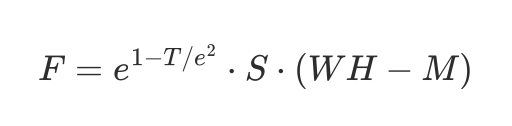

# PS3b: Sokoban

## Contact

> Name: Zhuojian Chen (James)
>
> Student ID: 02151380
>
> Section: COMP 2040 P 1 203
>
> Time to Complete: Feb 25, 2024

## Description

Sokoban is a puzzle video game in which the player pushes boxes around in a warehouse, trying to get them to storage locations. This program offers a straightforward rendition of the Sokoban game, known for its pixel-style design. The game world comprises numerous tiles, each measuring 64x64 pixels.

Upon startup, the program reads a designated level file (`.lvl`) to initialize the game map. Players navigate the character using either the "WASD" keys or the arrow keys, moving one tile per keypress. However, certain scenarios may block the player, halting their movement. Victory entails pushing all boxes to designated storage locations. When all boxes occupy storage spaces, or all storage spaces accommodate boxes, the player emerges triumphant.

### Features

1. **Classic Sokoban Gameplay**: Players can navigate the game grid using either the "WASD" keys or the arrow keys. Players cannot move through walls obstructing their path. They can push boxes onto designated targeted locations, encountering limitations such as being unable to move if facing a wall block, unable to push a box if it abuts a wall or another box blocks its path from behind.
2. **Elapsed Time**: In the upper-left corner of the game screen, players will find a stopwatch recording the elapsed time. Strategically, the less time a player utilizes to complete a level, the higher their final score will soar upon victory.
3. **Box and Storage Numbers**: In the upper-right corner of the game screen, players will notice a pair of numbers separated by a slash. The first number denotes the count of boxes successfully placed in storage units. In contrast, the second number indicates the maximum capacity of the storage units, calculated using the formula `min(numberOfBoxes, numberOfStorages)`. As the game progresses, aligning these numbers signals the player's path to victory: when the counts are equal, indicating all boxes are securely stowed, the player achieves victory.
4. **Undo and Restart**: Players can undo their moves during gameplay without halting the progress of the elapsed time. Additionally, they can restart the entire game, reverting the map to its initial state and resetting the elapsed time in the process.
5. **Result Screen**: After achieving victory, players encounter a result screen centered with the message 'You win!' prominently displayed. Below, a final score awaits, determined by the player's efficiency in time and moves: the quicker and fewer moves taken, the higher the score attained. The player cannot move after winning, but they can restart the game and start a new attempt.
6. **Music and Sound Effect**: At the beginning of the game, background music sets the tone, persisting until the player secures victory. Upon winning, players are greeted with a celebratory sound effect, marking their triumphant accomplishment.

### Key Map

* `W` and `Upper Arrow`: Move up one block.
* `A` and `Left Arrow`: Move left one block.
* `S` and `Down Arrow`: Move down one block.
* `D` and `Right Arrow`: Move right one block.
* `R`: Restart the game.
* `U`: Undo a move.

### Implementation

The source code files in this project are as follows:

~~~bash
.
├── InvalidCoordinateException.hpp
├── Sokoban.hpp
├── SokobanConstants.hpp
├── SokobanElapsedTime.hpp
├── SokobanPlayer.hpp
├── SokobanScore.hpp
├── SokobanTileGrid.hpp
├── main.cpp
└── test.cpp
~~~

* `InvalidCoordinateException`: An exception class is thrown when an invalid coordinate is used.
* `Sokoban`: The Sokoban game class, which inherits `SokobanElapsedTime`, `SokobanPlayer`, `SokobanScore`, and `SokobanTileGrid`.
    * `m_hasWon`: If the player has won the game.
    * `m_soundMap`: The game sound effects, including background music. The keys of this map are sound filenames.
    * `m_font`:  The font for the triumph message.
    * `m_stateStack`: The stack of states.
* `SokobanConstants`: Stores all the constants that are related to the game.
* `SokobanElapsedTime`: Manages the elapsed time system in Sokoban. It draws the elapsed time onto the screen.
    * `m_elapsedTimeInMicroseconds`: The elasped time in microseconds.
* `SokobanPlayer`: Manages the player system in Sokoban. It stores the player's location and orientation. It draws the player onto the screen.
    * `m_playerLoc`: Player location. Note the unit of this coordinate is tile instead of pixel.
    * `m_playerTextureMap`: Associates each direction with the corresponding player texture.
    * `m_playerSpriteMap`: Associates each direction with the corresponding player sprite. Player sprites vary depending on the orientation.
    * `m_playerOrientation`: Player's current orientation. The default orientation is down.
* `SokobanScore`: Manages the scoring system in Sokoban. Here the score refers to the number of boxes that are stowed properly. It draws the score and max score onto the screen.
    * `m_score`: The player's current score. Players get one score when they successfully put a box to a storage. In a word, the score is equals to the number of "StorageBox" block in the map.
    * `m_maxScore`: he player's max score in the current level.
* `SokobanTileGrid`: Manages the tile grid system in Sokoban. It draws the tile grid onto the screen.
    * `m_width`: The number of tile columns.
    * `m_height`: The number of tile rows.
    * `m_tileTextureMap`: Associates characters with their respective tile texture.
    * `m_initialTileCharGrid`: The initial tile char grid.
    * `m_tileCharGrid`: Represents the tile character grid, which is mapping into an one-dimentional array in row-major order.
    * `tile_grid`: Represents the tile grid, which is mapping into an one-dimentional array in row-major order.
* `main`: Contains the main function.
* `test`: Contains unit tests leveraging `Boost`.


Four parent classes that `Sokoban` derives from inherits `sf::Drawable` and rewrites the `draw` method. Each `draw` method is responsible for the different part of the screen. In `Sokoban::draw` method:

~~~c++
void Sokoban::draw(sf::RenderTarget& target, const sf::RenderStates states) const {
    SokobanTileGrid::draw(target, states);
    SokobanPlayer::draw(target, states);
    SokobanElapsedTime::draw(target, states);
    SokobanScore::draw(target, states);

    // Display the victory notice if the player has won the game
    if (m_hasWon) {
        drawResultScreen(target, states);
    }
}
~~~

It sequentially calls the `draw` method in each based class. The `SokobanTileGrid::draw()` draws the tile sprites one after one; the `SokobanPlayer::draw()` draws the player on the specified location; the `SokobanElapsedTime::draw()` draws the time in the format of *H:MM:SS* in the upper-left corner; and the `SokobanScore::draw(target, states)` draws the current score and max score in the upper-right corner.


The `Sokoban::movePlayer()` method is one of the significant functions in the whole project. It changes the player's location based on a specified direction. It also changes the location of the box that is pushed upon the player's movement. The method is fully commented on in `Sokoban.cpp`:

```cpp
void Sokoban::movePlayer(const Direction& direction) {
    // If the player has won the game, it can't move anymore
    if (isWon()) {
        return;
    }

    const State state = { m_playerOrientation, m_playerLoc, m_tileCharGrid, m_score };

    // Change the player's orientation
    m_playerOrientation = direction;

    // Find the coordinate of the block to move to
    const auto nextLoc{ getNextLoc(m_playerLoc, direction) };

    // If the next location is out of the map, stay on the spot
    const auto nextLocIndex = getIndex(nextLoc);
    if (nextLoc.x < 0 || nextLoc.x >= m_width || nextLocIndex < 0 ||
        nextLocIndex >= m_width * m_height) {
        return;
    }

    // Get the texture of the next block
    const auto nextBlock = getTileChar(nextLoc);

    // If the coordinate corresponds to a wall block or a box storage, stay on the spot
    if (nextBlock == TileChar::Wall) {
        return;
    }

    // If the coordinate corresponds to an box block, try to push the box to the other side
    if (nextBlock == TileChar::Box || nextBlock == TileChar::BoxStorage) {
        const auto canMoveBox = moveBox(nextLoc, direction);
        if (!canMoveBox) {
            return;
        }
    }

    // Save the current move
    m_stateStack.push(state);

    // Update player location
    m_playerLoc = nextLoc;
}
```

### Memory Management

In this version, smart pointers are used frequently to store the game resources such as textures, sprites, fonts, and sounds. For example, the player texture and sprites are stored in unordered maps as follows:

```c++
std::unordered_map<Direction, std::shared_ptr<sf::Texture>> m_playerTextureMap;
std::unordered_map<Direction, std::shared_ptr<sf::Sprite>> m_playerSpriteMap;
```

The textures loaded into `m_playerTextureMap` are managed by shared pointers, ensuring they persist until `m_playerTextureMap` is deallocated. By using smart pointers, I am free to delete resources when they are no longer used.

### Lambda Expressions

In `SokobanTileGrid` class exists a function that takes a lambda expression as a parameter:

```c++
/**
 * @brief Iterates over each tile character in the grid and invokes the specified callback
 * function for each tile, providing the tile's coordinate and its associated tile character.
 * The callback function should return true to continue the traversal or false to stop it.
 * @param callback The callback function is to be invoked for each tile.
 */
void traverseTileCharGrid(const std::function<bool(sf::Vector2i, TileChar)>& callback) const;
```

This function will traverse the `m_tileCharGrid`, and call the lambda function. This function comes in handy in many scenarios. The following is an example of taking advantage of this function:

~~~c++
auto boxCount{ 0 };
auto storageCount{ 0 };
auto boxStorageCount{ 0 };

traverseTileCharGrid([&](auto coordinate, auto tileChar) {
    m_tileGrid.push_back(getTile(tileChar));
    if (tileChar == TileChar::Player) {
        m_playerLoc = coordinate;
        setTileChar(coordinate, TileChar::Empty);
    } else if (tileChar == TileChar::Box) {
        ++boxCount;
    } else if (tileChar == TileChar::Storage) {
        ++storageCount;
    } else if (tileChar == TileChar::BoxStorage) {
        ++boxStorageCount;
    }

    return false;
});
~~~

In this code snippet, `traverseTileCharGrid` is used to traverse all the tile characters in `m_tileCharGrid`. For each tile character, a tile corresponding to it is pushed back to the `m_tileGrid`, and `boxCount`, `storageCount`, and `boxStorageCount` are updated based on the type of the tile character.

### Algorithms

In the `Sokoban::drawResultScreen()` method, the final score is computed in the following formula:




Where $F$ is the final score, $T$ is the consumed time in seconds, $S$ is the number of boxes that are stowed in the storages, $W$ is the width of the map, $H$ is the height of the map, and $M$​ is the number of moves the player used.

In the `Sokoban::reset()` method, the STL algorithm `std::min` is used to find the `m_maxScore`.

```c++
m_maxScore = std::min(storageCount, boxCount) + boxStorageCount;
```

### Unit Tests

All unit tests for this project are placed in `test.cpp`. Unit tests from top to bottom do the following things:

* `testHeightWidth`: Tests if `height()` and `width()` return the height and width of a map correctly.
* `testPlayerPosition`: Tests if `playLoc()` returns the correct player location at the beginning of the game.
* `testMovePayer`: Tests if `movePlayer(SB::Direction)` works correctly: a player should be able to push a box if the box is not blocked by a wall or another box.
* `testMovePayerBlockedByBox`: Tests if `movePlayer(SB::Direction)` works correctly: a player should not push a box that is blocked by another box.
* `testMovePayerBlockedByWall`: Tests if `movePlayer(SB::Direction)` works correctly: a player should not push a box that is blocked by a wall block.
* `testMovePayerUpBorder`: Tests if `movePlayer(SB::Direction)` works correctly: a player should not move out of the map from the upper border.
* `testMovePayerRightBorder`: Tests if `movePlayer(SB::Direction)` works correctly: a player should not move out of the map from the right border.
* `testMovePayerDownBorder`: Tests if `movePlayer(SB::Direction)` works correctly: a player should not move out of the map from the down border.
* `testMovePayerLeftBorder`: Tests if `movePlayer(SB::Direction)` works correctly: a player should not move out of the map from the left border.
* `testIsWon`: Tests if `isWon()` works correctly: If all boxes are already in the correctly, it should return true.
* `testIsWonTooManyBoxes`: Tests if `isWon()` works correctly: If there are two boxes and only one storage, players win as long as they push one box to the storage.
* `testIsWonTooManyStorages`: Tests if `isWon()` works correctly: If there are three storages but only two boxes, players win when they stow the boxes properly.

### Extra Credit

* **Player changes direction while moving**: In the `movePlayer` method, the player's direction is changed as long as the game is not over.
* **Plays victory sound**: I added a victory sound effect that is played upon victory.
* **Can undo moves**: Players can undo their moves by pressing the `U` key. And they can undo as much as they want.
* **(New) Final score**: A final score will be displayed in the center of the window below the triumph message. See [Algorithms](#Algorithms) to see how to final score is computed.
* **(New) Extra level**: I added a level file `level7.lvl` to `assets/level`. It is more complicated to solve than the provided levels. I got a 280 final score personal best!

## Acknowledgments

* Kenney Sokoban Pack (CC0): https://kenney.nl/assets/sokoban
* Digital 7 Font: https://www.dafont.com/digital-7.font
* Font: https://fonts.google.com/specimen/Roboto
* Pixel Perfect (background music): https://elements.envato.com/pixel-perfect-LMWJFGY
* Win Game Sound (game-winning sound effect): https://elements.envato.com/win-game-sound-WASB34G

> All resource files are placed in the `assets` directory.

### Reference

* [SFML - Text and fonts](https://www.sfml-dev.org/tutorials/2.6/graphics-text.php)
* [GCC Environment Variables](https://gcc.gnu.org/onlinedocs/cpp/Environment-Variables.html)
* [SFML - Playing sounds and music](https://www.sfml-dev.org/tutorials/2.6/audio-sounds.php)