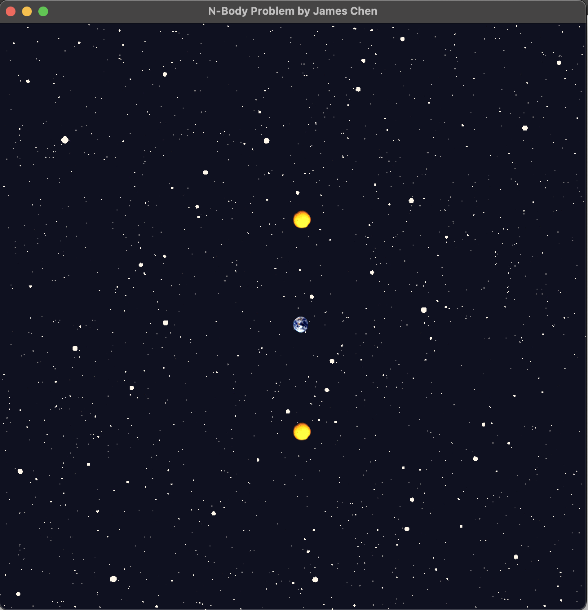

# PS4: N-Body Simulation

## Contact

> Name: Zhuojian Chen (James)
>
> Student ID: 02151380
>
> Section: COMP 2040 P 1 203
>
> Time to Complete: March 12, 2024

## Description

This program loads and displays a static universe. It reads input data, including the number of planets, the radius of the universe, and the data of each planet, which consists of initial position, velocity, mass, and the filename of the image. After reading all the data, the program shows a window displaying the planets with a captivating background.



### Features

This project encompasses the creation and implementation of two classes: `Universe` and `CelestialBody`.

`Universe` encapsulates a vector of celestial bodies, alongside attributes such as radius and scale. The scale represents the ratio of the universe's diameter to the width of the displayed window.

On the other hand, `CelestialBody` comprises attributes such as position, velocity, mass, and more. Notably, `CelestialBody` features a distinctive constructor that accepts a `Universe` object as a parameter, facilitating its instantiation within the universe context.

### Memory

No raw pointers are used in this program. Texture, sprite, and sound (including sound buffer) resources are stored using `std::shared_ptr`. For instance, the image of each `CelestialBody` is stored in a pair with two shared pointers:

~~~c++
/**
 * @brief Pair containing shared pointers to the texture and sprite of this CelestialBody.
 */
std::pair<std::shared_ptr<sf::Texture>, std::shared_ptr<sf::Sprite>> m_image;
~~~

This can be found in `CelestialBody.hpp`, line 123.

### Algorithm

In `Universe.cpp`, `std::for_each` is used to draw celestial bodies onto the target:

```c++
auto drawCelestialBody = [&](const std::shared_ptr<CelestialBody>& celestialBody) {
    celestialBody->draw(target, states);
};

std::for_each(m_celestialBodyVector.cbegin(), m_celestialBodyVector.cend(), drawCelestialBody);
```

The usage of lambda expression enhances the readbility and robustness of the program.

### Issues

In this project, I fixed some issues and learned the following things:

1. While getters look like `getProperty()` in Java style, it is simply `property()` in C++ style.
2. When we create an object and push it to a `vector`, the vector makes a copy of the object.

There is still one thing that I still unable to figure out: my program does not pass the *"1.1) Your Tests vs: Formatting (0/1)"* test case in Gradescope. Doctor Daly pointed out that my program permitted a flawed implementation to succeed. Despite my efforts to identify and rectify issues, I remain uncertain about the specifics of the flawed implementation. I've attempted various approaches, including implementing exception handling for incorrect input formats, but none seem to resolve the underlying problem.

### Extra Credit

1. I have incorporated a background image into the program. For the reference of the background image utilized, please refer to the **Acknowledgments** section.
2. I have incorporated the `2001.wav` background music, which is in the provided resource package, into the program.

## Acknowledgments

Background image: [Stars](https://elements.envato.com/stars-ZFJ7AAD) from https://elements.envato.com.