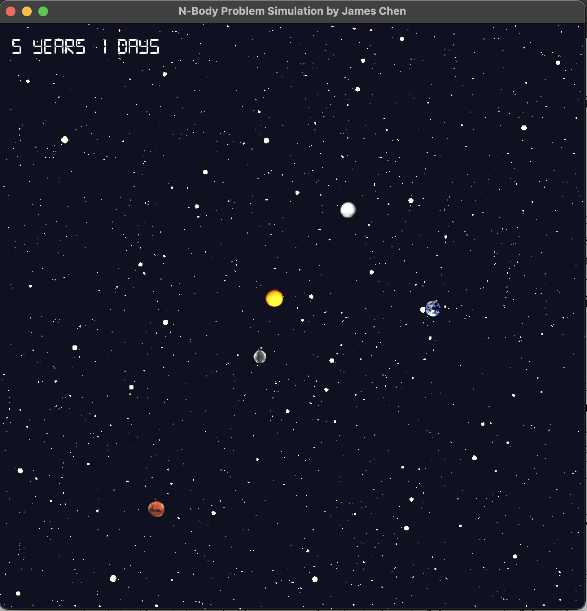

# PS4: N-Body Simulation

## Contact

> Name: Zhuojian Chen (James)
>
> Student ID: 02151380
>
> Section: COMP 2040 P 1 203
>
> Time to Complete: March 12, 2024

## Description

This program is designed to load, visualize, and simulate the motion of celestial bodies within a universe. It operates by taking two crucial arguments: the total simulation time `T` and the time step `△t`. Upon execution, it ingests input data, which includes information such as the number of planets, the universe's radius, and specific details for each celestial body like initial position, velocity, mass, and the corresponding image filename. Once all data is gathered, the program presents a visually engaging window displaying the celestial bodies against a captivating backdrop. Subsequently, it executes a simulation of the celestial bodies' movements over the time span `T`, employing the
*leapfrog finite difference approximation
scheme* with the given time step `△t`. Upon the accumulated step time is over total time `T`, the simulation stops and the final state of the universe will be printed on the console.



### Features

This project encompasses the creation and implementation of two classes: `Universe` and `CelestialBody`.

`Universe` encapsulates a vector of celestial bodies, alongside attributes such as radius and scale. The scale represents the ratio of the universe's diameter to the width of the displayed window. Additionally, it features a `step` function, accepting a time delta in seconds as a parameter, responsible for advancing the state of celestial bodies to the subsequent one in their trajectory.

On the other hand, `CelestialBody` comprises attributes such as position, velocity, mass, and more. Notably, `CelestialBody` features a distinctive constructor that accepts a `Universe` object as a parameter, facilitating its instantiation within the universe context.

### Memory

No raw pointers are used in this program. Texture, sprite, and sound (including sound buffer) resources are stored using `std::shared_ptr`. For instance, the image of each `CelestialBody` is stored in a pair with two shared pointers:

~~~c++
/**
 * @brief Pair containing shared pointers to the texture and sprite of this CelestialBody.
 */
std::pair<std::shared_ptr<sf::Texture>, std::shared_ptr<sf::Sprite>> m_image;
~~~

This can be found in `CelestialBody.hpp`, line 118.

The storage of `CelestialBody` in the class `Universe` also leverages smart pointers:

```c++
 /**
  * @brief Vector of CelestialBodies in this Universe.
  */
std::vector<std::shared_ptr<CelestialBody>> m_celestialBodyVector;
```

This can be found in `Universe.hpp`, line 116.

### Algorithm

In `Universe.cpp`, `std::for_each` is used to draw celestial bodies onto the target:

```c++
auto drawCelestialBody = [&](const std::shared_ptr<CelestialBody>& celestialBody) {
    celestialBody->draw(target, states);
};

std::for_each(m_celestialBodyVector.cbegin(), m_celestialBodyVector.cend(), drawCelestialBody);
```

The usage of lambda expression enhances the readbility and robustness of the program.

### Issues

No specific issues were found during the process of `ps4b`.

### Extra Credit

1. The elapsed time, displayed in the top-left corner of the screen, dynamically adjusts its units based on the duration. When the elapsed time is less than one day, it's represented in seconds. If it exceeds one day but is less than a year, it switches to days. Beyond a year, it shows the duration in years and days for comprehensive tracking.

2. I created a new universe file ([assets/gravity-assist.txt](assets/gravity-assist.txt)) and wrote a full explanation of it in the file. The following are copy-and-pasted:

   > **Gravity Assist**
   >
   > In the blockbuster film "The Wandering Earth," humanity faces an unprecedented crisis as the impending explosion of the sun threatens all life on Earth. In a desperate bid for survival, scientists devise an audacious plan: to physically relocate the entire planet out of harm's way. Harnessing the immense gravitational pull of Jupiter, they plot a daring trajectory that utilizes the gas giant's gravitational force as a slingshot, propelling Earth on a monumental journey through the cosmos. This ambitious strategy not only conserves precious energy but also imparts the
   > necessary kinetic boost to alter Earth's trajectory, steering it away from the sun's catastrophic fate. As mankind's fate hangs in the balance, the stage is set for an epic interstellar adventure unlike any other.
   >
   > In this simulation, Jupiter stands as the fixed anchor at the center of the universe, while Earth sets its course towards the gas giant. As Earth draws near to Jupiter, it undergoes a dynamic sequence of events: initially accelerating under the gravitational influence, then curving its trajectory as it bends towards the colossal presence of Jupiter, before gradually decelerating as it ventures away from its gravitational grasp. This intricate dance of forces illustrates the profound interplay between celestial bodies, shaping the paths they traverse through the vast expanse of space.

## Acknowledgments

Background image: [Stars](https://elements.envato.com/stars-ZFJ7AAD) from https://elements.envato.com.
